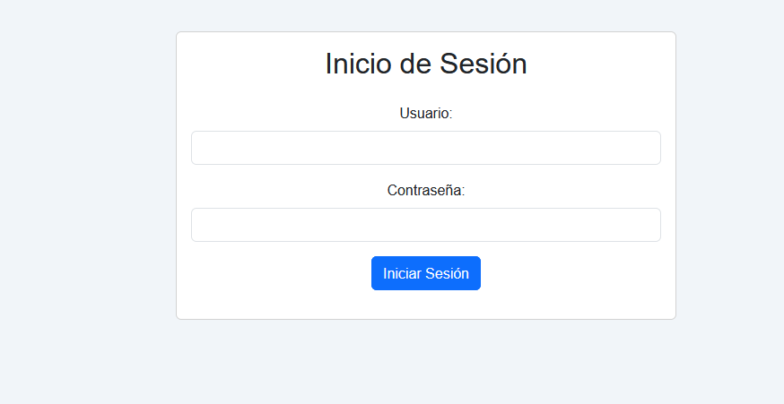

# 💵 Sistema de Facturación

Este proyecto es un **sistema de facturación completo** desarrollado con **Vue.js** (frontend), **Express.js** (backend) y **MongoDB** (base de datos).  

Permite gestionar clientes, productos y facturas de manera sencilla y eficiente.

---

## ⚡ Características

- 👥 Gestión de clientes  
- 📦 Gestión de productos  
- 🧾 Generación de facturas  
- 📊 Visualización de historial de ventas  
- 🔒 Autenticación de usuarios  
- 🌐 API REST con Express y MongoDB  

---

## 🖼️ Vistas de la aplicación

### 📌 Dashboard


### 📌 Gestión de clientes


### 📌 Facturación


---

## 🛠️ Tecnologías usadas

- **Frontend:** Vue.js  
- **Backend:** Node.js + Express.js  
- **Base de datos:** MongoDB  
- **ORM / ODM:** Mongoose  

---

## 🚀 Instalación y ejecución

### 🔹 Backend (Express + MongoDB)

1. Ir a la carpeta del backend:
   ```bash
   cd backend
   npm install
